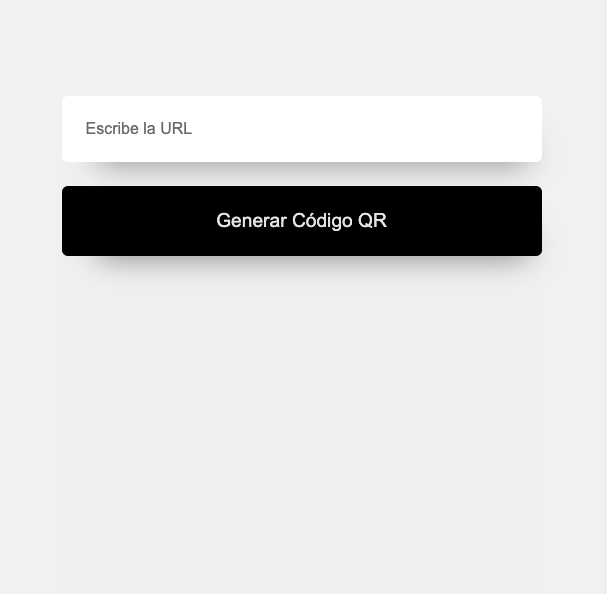
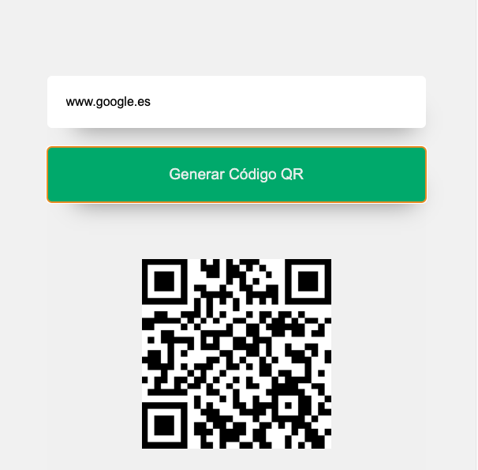

# Generador de código QR  |   <a href="https://lupemorales.github.io/generador-qr-js/" target="_blank">   Demo </a> | 
    

Este pequeño proyecto es perfecto para desarroladores que empiezan. Crea un generador de códigos QR usando una librería externa.

- Introduce la URL.
- Haz click en el botón.
- Et voilà!!. El código se genera automáticamente

El uso de librerías de terceros es el pan de cada día de un desarrollador. Pequeños proyectos como este te ayudarán a acostumbrarte poco a poco a usarlas leyendo la documentación. 

Para este proyecto usaremos una librería muy sencilla: [QRCodeJS](https://github.com/davidshimjs/qrcodejs?utm_source=cdnjs&utm_medium=cdnjs_link&utm_campaign=cdnjs_library)

Puedes conseguir el script de la librería [aquí](https://cdnjs.com/)

### Vista de la app:

## Objetivo:

- :raised_hands: Mover las manitas. A programar se aprende programando!
- :books: Usar librerías externas
- :tada: ¡¡¡Divertirnos!!!

    

## Contacto

- [Portfolio](https://lupemorales.github.io/portfolio/)
- GitHub [@lupeMorales](https://github.com/lupeMorales )
- Linkedin [@GuadalupeMoralesCarmona](https://linkedin.com/in/guadalupe-morales-carmona-817245226/ )

**Let´s have fun coding!** 🚀